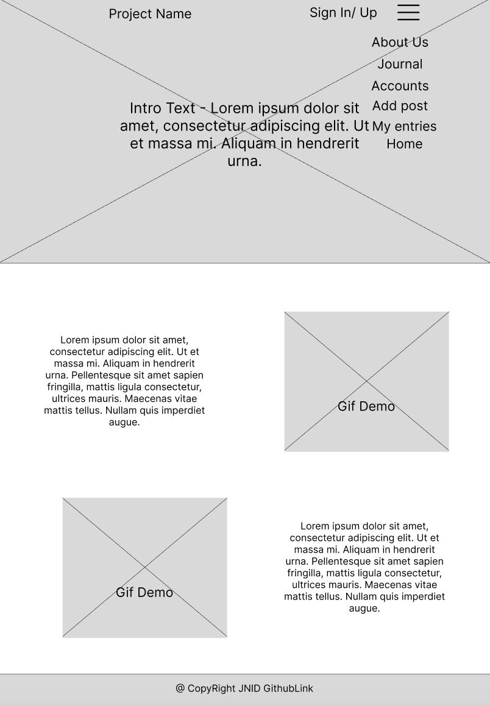
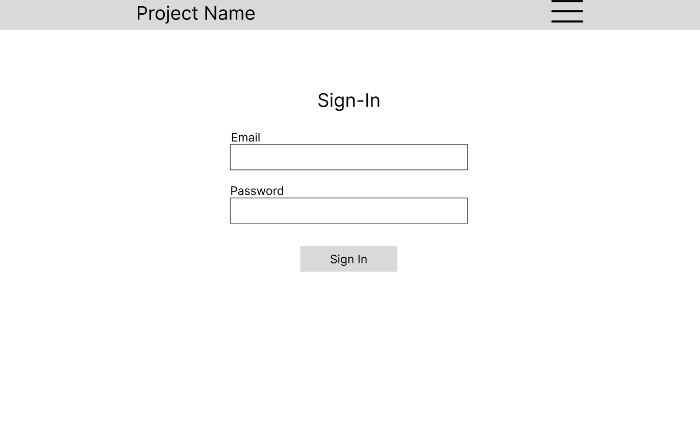
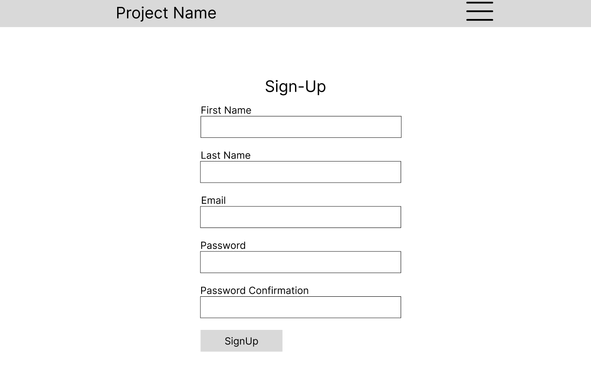
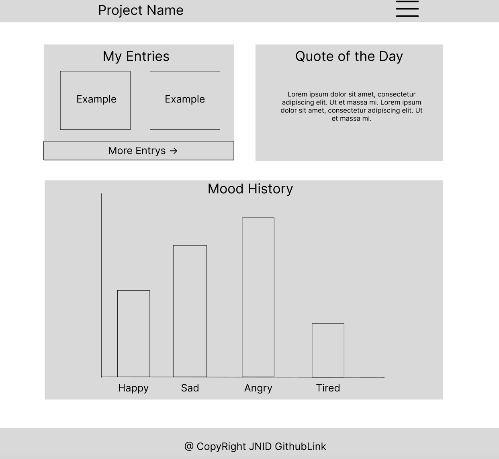
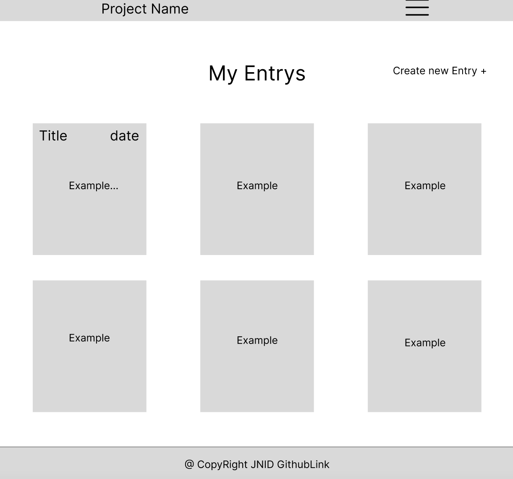
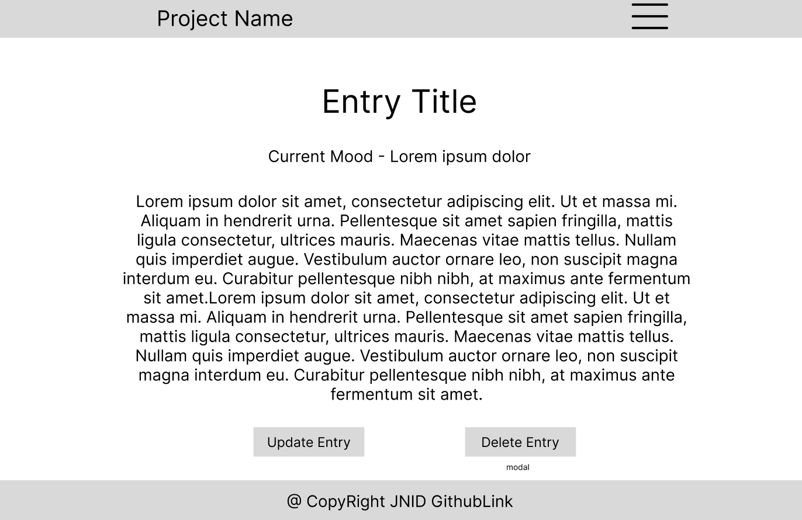
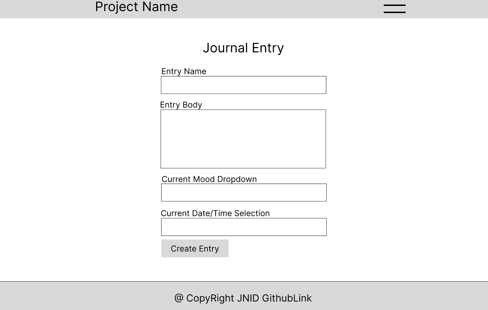
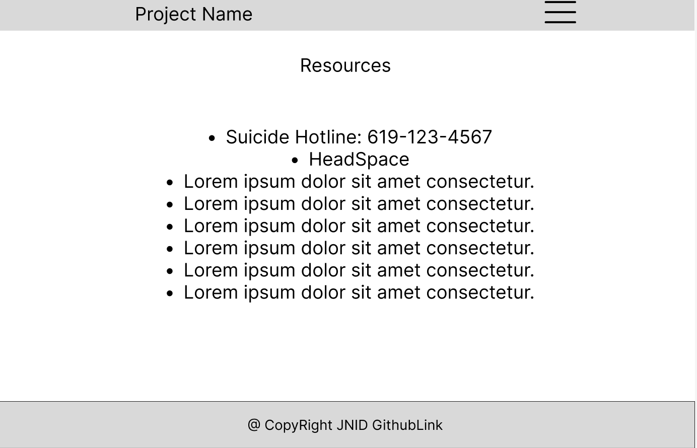
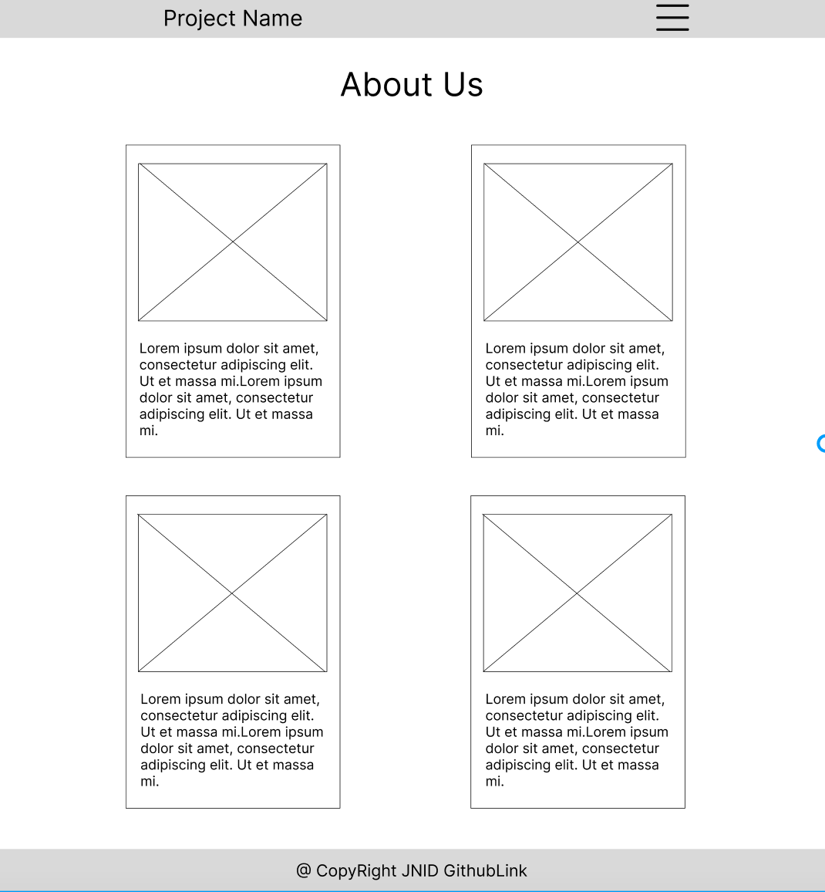
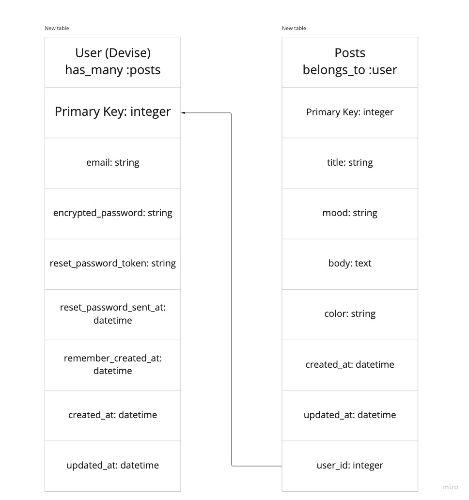

# BrightMind!

[BrightMind Live Link](https://calm-plateau-12315.herokuapp.com/)

## Overview
- The statistics from the World Health Organization (WHO) states that 3.8% of the population or 280 million people in the world have depression and 301 million suffering with an anxiety disorder.
- 'BrightMind' is a mental wellness web application that provides users a private journaling experience. Numerous studies have shown that journaling can reduce overall levels of depression and anxiety.  By keeping a journal, people are able to take the weight off their shoulders, fully express themselves, and identify the root of their problems. To creating order when your world feels like chaos.
Journaling alone can help you: manage anxiety, reduce stress, and cope with depression. As people that have endured these mental health issues, we want to help.
- This app was created for LEARN Academy Charlie Cohort 2022.

## Features
- User Login and Authentication
- Mobile Friendly
- Confidential Journaling
- Services to self-care
- Chart display of previous posts
- CRUD
- Quote Generator API: [Type.fit](https://type.fit/api/quotes)

## Running The Project

### Local Host
- `git clone` the repository
- `cd` into the repository
- `bundle`
- `yarn`
- `rails db:create`
- `rails db:migrate`
- `rails s`
- In you browser (while the server is running 'rails s')`localhost:3000`
- Create an account
- Start Journaling!

### Testing
- `yarn jest --coverage`
- `rspec spec/models/filename`
- `rspec spec/requests/filename`

## Built With
- React on Rails
- React Strap
- Yarn
- Javascript
- PostgreSQL
- Active Record
- Heroku

## Dependencies
- "react": "^18.2.0",
- "react-dom": "^18.2.0",
- "react-icons": "^4.4.0",
- "react-router-dom": "5.3.3",
- "react_ujs": "^2.6.2",
- "reactstrap": "^9.1.1",
- "webpack": "^4.46.0",
- "webpack-cli": "^3.3.12",
- "enzyme": "^3.11.0",
- "enzyme-adapter-react-16": "^1.15.6",
- "jest": "^28.1.2",
- "react-test-renderer": "^18.2.0",
- "webpack-dev-server": "^3"

### How to Deal with it
- There a various way to identify and treat mental health symptoms that people may not know about. However, treatments vary depending on the severity

- We want to be a part of the solution by giving our users the ability to reduce their stressors by putting thoughts on to paper so that they do not have to worry about it anymore. By journaling and promoting links to help.

## Architecture

### Wireframing
1. Home

2. Sign-in

3. Sign-up

4. Account

5. Index

6. Show

7. New / Edit

8. Resources

9. About Us

### User Stories
- As a User, I want to be able to sign-in / sign-up / create a new account

### Database Schema
- 

### Contributors
- Nic Last
    - [Github](https://github.com/niclast7611)
    - [LinkedIn](https://www.linkedin.com/in/nicolas-last-095099239/)
- Ivan Ortega
    - [Github](https://github.com/iiAnti)
    - [LinkedIn](https://www.linkedin.com/in/ivanocreates/)
- Davon Kennedy
    - [Github](https://github.com/DavonKenn)
    - [LinkedIn](https://www.linkedin.com/in/davon-kennedy-893b1b242/)
- Jenner Dulce
    - [Github](https://github.com/jennerdulce)
    - [LinkedIn](https://www.linkedin.com/in/jennerdulce/)

## Other

## Credit and Collaborations
- [Figma](https://figma.com/) for initial wireframing.
- [Trello](https://trello.com/) for project management.
- [Stack Overflow](https://stackoverflow.com/) for the struggles.
- [LEARN Academy](https://github.com/learn-academy-2022-charlie/Syllabus) for general guidance.
- LEARN Staff
    - Austin Walker
    - Charlene Baxter
    - Sarah Proctor
- Mentor: Erik Guzman